# Advanced Learning Algoritms

**4 Topics**
- ## (week 1) Neural Networks.
- ## (week 2) Neural Network Training.
- ## (week 3) Advise for appying machine learning.
- ## (week 4) Decision trees.

## (week 1) Neural Networks
- **(Deep Learning Algorithms)**
- Neural Networks intuition
    - Neurons and the brain
        - **Learn how to make better decisions on how to approach practical Deep Learning Algoritms**
        - Neural Netowrks first impacted speech recognition, images (computer vision), text (natural language processing).
        - 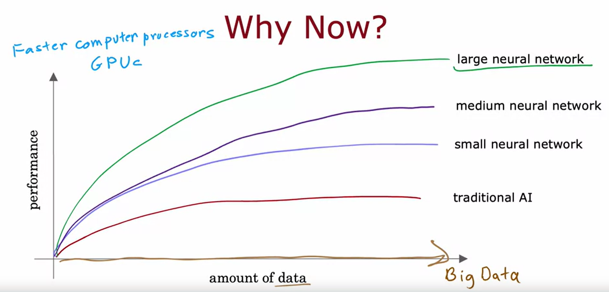
    - Demand Prediction
        - 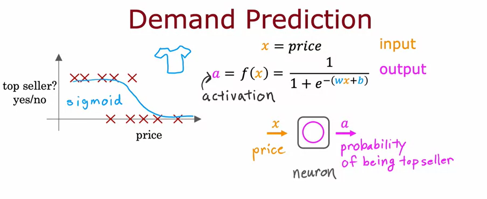
        - Neuron is like a tiny litte computer
        - 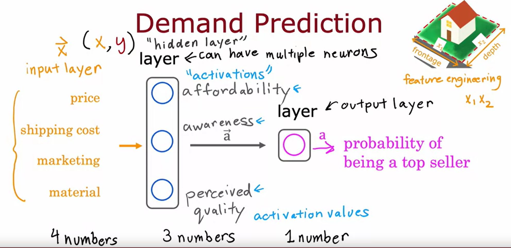
        - hidden layer
            - Each neuron has access to every feature and value from the previous layer
            - it figures out which features to use automatically by setting the parameters appropriately
        - multiple hidden layers
            - 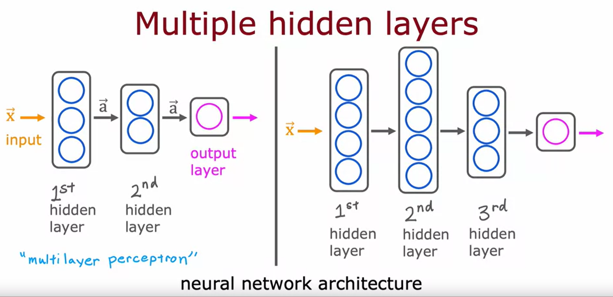
            - neural network architecture
                - How many layers do you want
                - how many neurons in each layer
                *learn later tips for choosing*
    - Recognizing images
        - 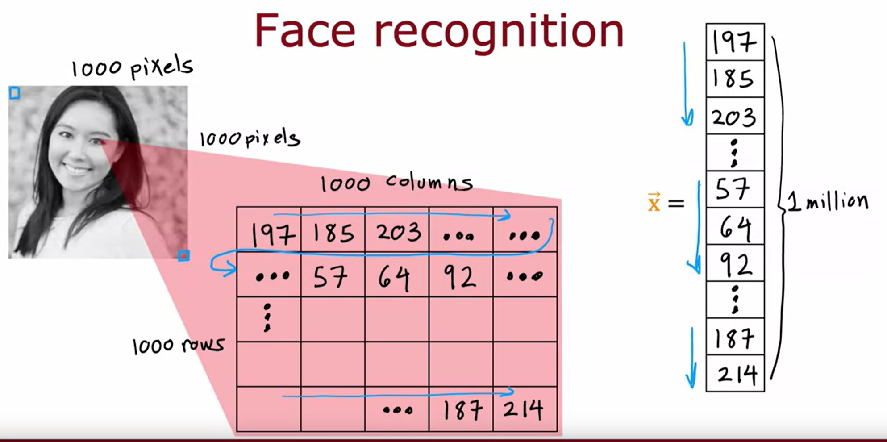
        - 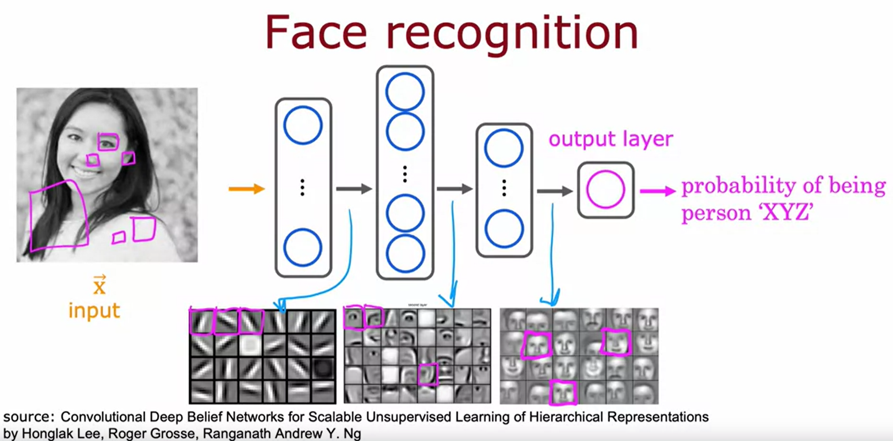
        - 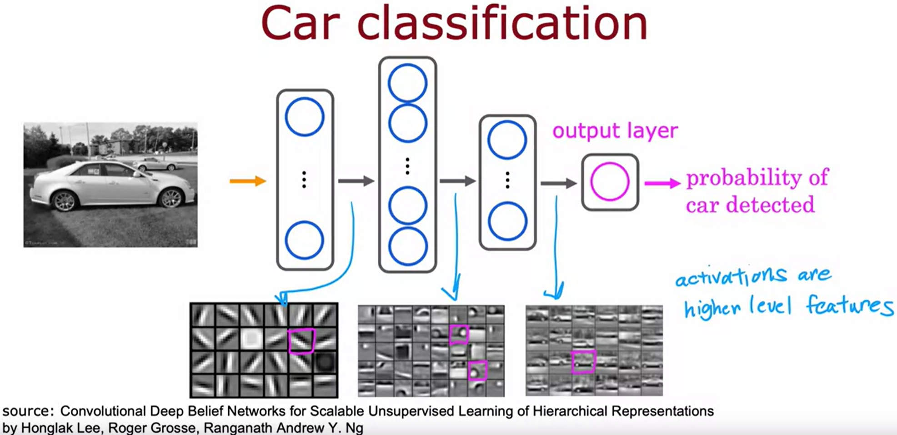
- Neural network model
    - Neural Network Layer
        - *Learn how to construct a layer of neurons.*
        - 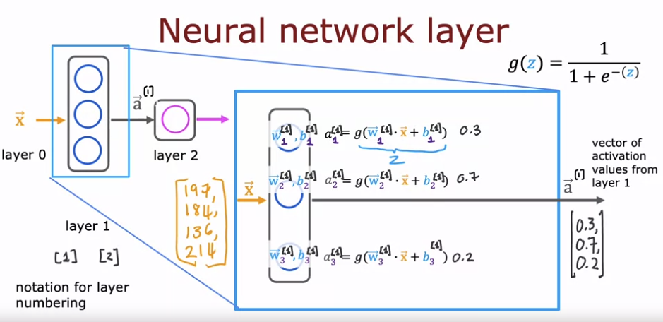
        - Input of Layer 2 is output of layer 1.
        - Uses logistic regression sigmoid function to get activation function for each neuron.
        - 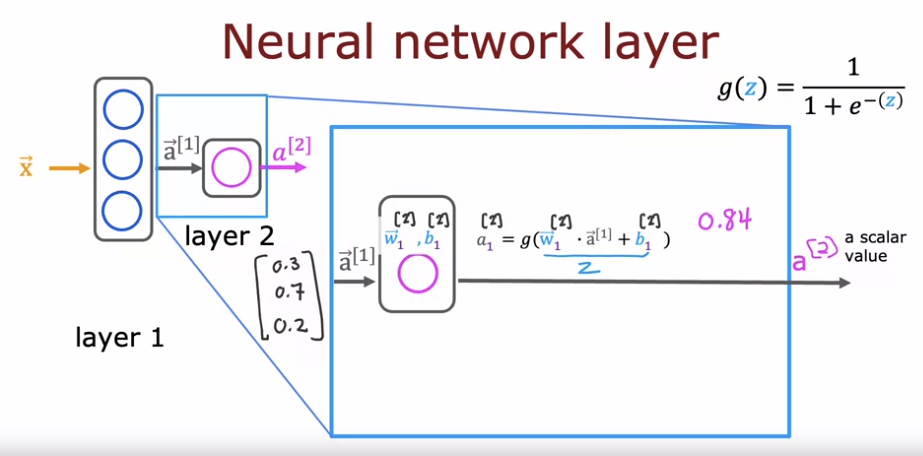
        - 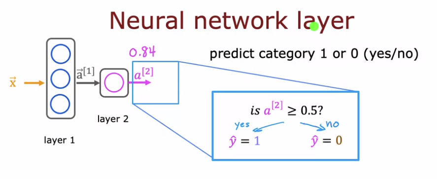
        - Every layer inputs a vector of numbers, applies logistic regression and computes another vector of numbers.
    - More Complex Neural networks
        - Neural Network with 4 layers
            - Layers 1, 2, 3 are hidden layers.
            - Input is layer 0
            - Output is layer 4
            - 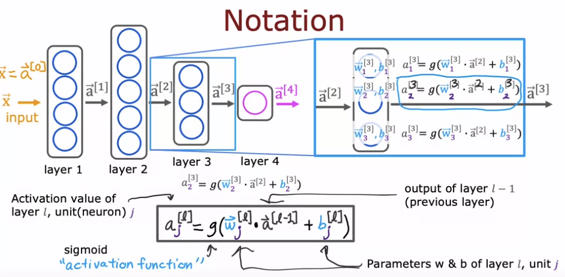
    - Inference: making predictions (forward propagation algorithm)
        - *how to get a neural network to make predictions*
        - handwritten digit recognition
        - Compute a[1] - 25 neurons (units)
            - 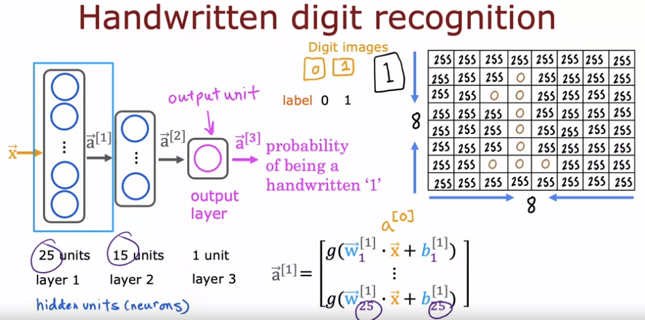
        - Compute a[2] - 15 neurons (units)
            - 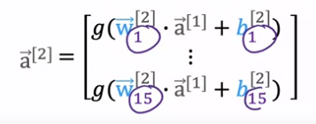
        - Compute a[3]
            - 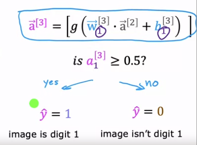
- Tensorflow implementation
    - Inference in Code
        - 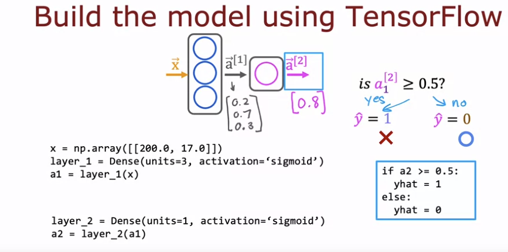
        - 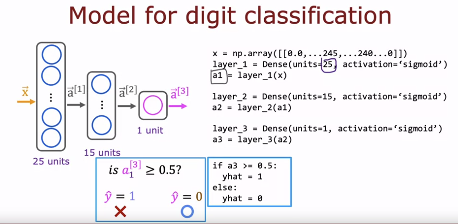
    - Data in Tensorflow
        - *how data is represented*
        - 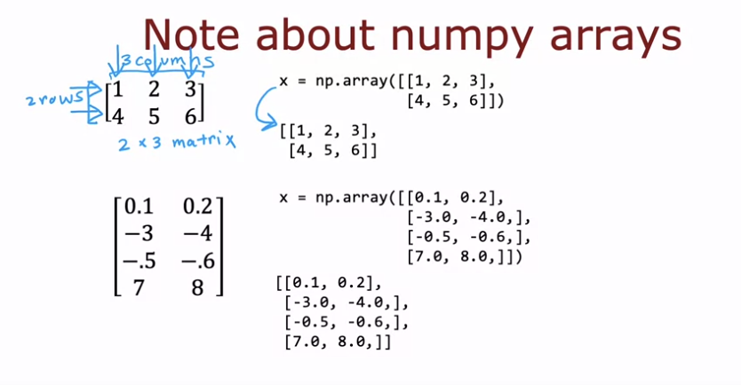
        - rows * columns
        - 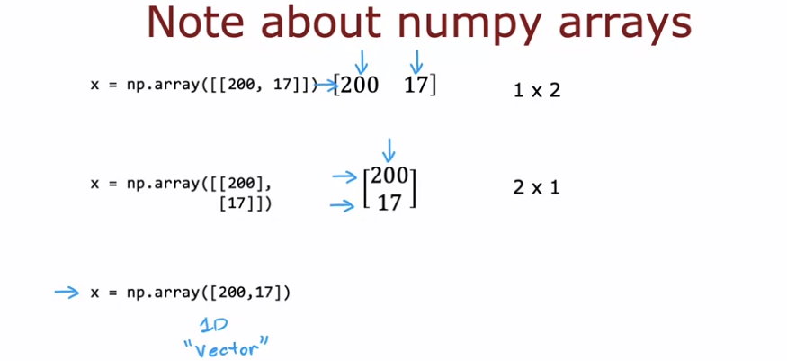
        - 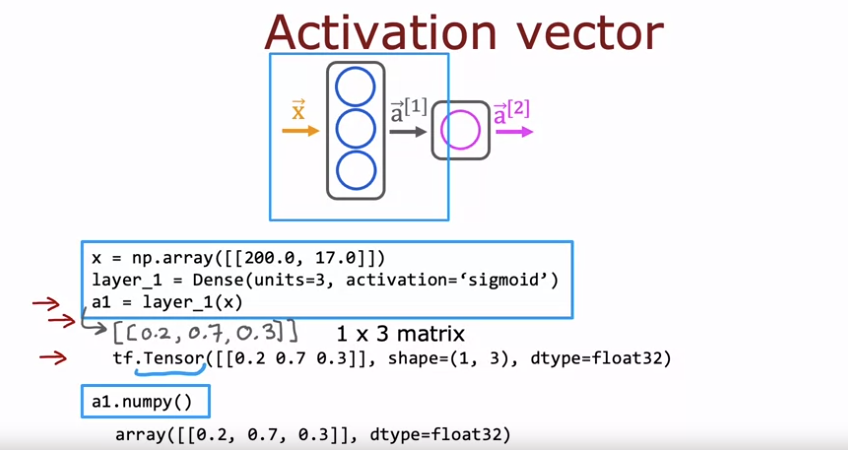
        - *Tensor is a way of showing a matrix*
    - Building a neural network
        - *how to build neural network in tensorflow*
        - 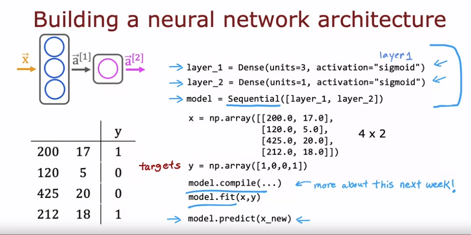
        - 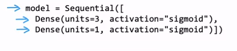
        - 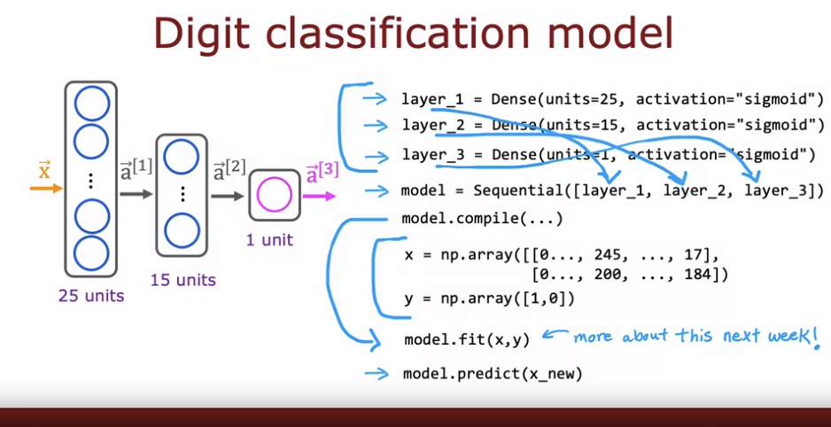
- Neural Network implementation in python
    - Forward prop in a single layer
        - 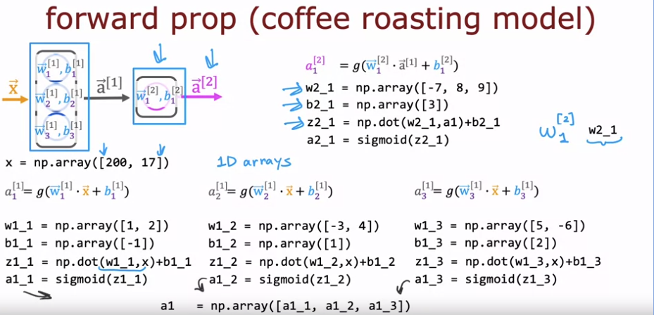
    - General implementation of forward propagation
        - 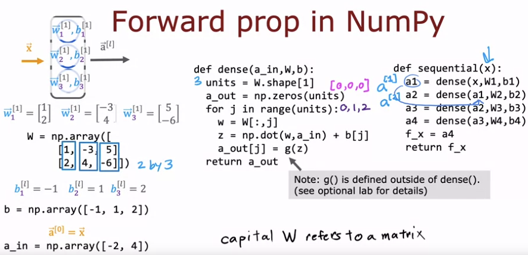
        # Code
        def dense(a_in, W, b):
            units = W.shape[1] # Gets number of units
            a_out = np.zeros(units) # sets array of zeros for number of units
            for j in range(units):
                w = W[:,j]
                z = np.dot(w, a_in) + b[j]
                a_out[j] = g(z)
            return(a_out)
       
        def my_sequential(x, W1, b1, W2, b2):
            a1 = dense(x, W1, b1)
            a2 = dense(a1, W2, b2)
            return(a2)
- Speculations on artificial general intelligence (AGI)
- Vectorization (optional)
*practice lab Neural Networks - see Coursera code*