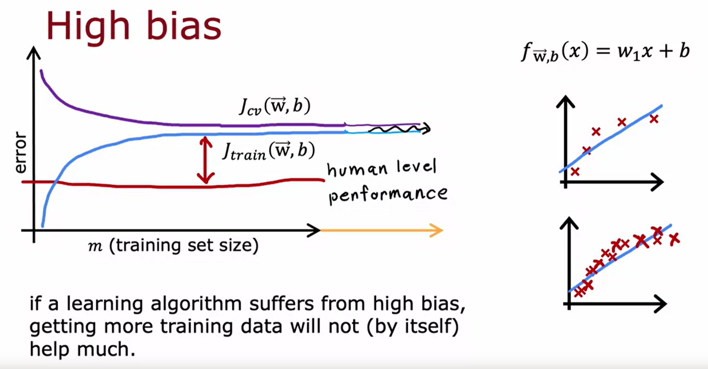

## (week 3) Advise for Applying Machine Learning
- Advise for Applying Machine Learning
    - Deciding what to try next
        - 
    - Evaluating a model
        - Split data into training and test set
        - 
        - 
        - 
        - 
        - 
    - Model Selection and training
        - 
        - Better method is split data into training set (60%), Cross validation set (20%), and test set (20%).
        - 
        - 
        - 
- Bias and Variance
    - Diagnostic Bias and variance
        - Looking at bias and variance gives good guidance on what to do next
        - If j train is high, algorithm has high bias
        - if jcv is higher than j train, your algorithm has high variance
        - 
        - 
        - 
    - Regularization with bias and variance
        - 
        - 
        - 
    - Establishing a baseline level of performance
        - 
    - Learning Curves 
        - 
        - 
        - 
    - Debugging
        - 
    - Bias/Variance in neural networks
        - 
        - 
        - 
- Machine Learning Development Process
    - Iterative loop of ML development.
        - Step 1: Develop overall architecture
            - Decide what model to use.
            - What data to use, hpyerparameters
        - Step 2: Then you implement and train the model
        - Step 3: Look at diagnostics, variance, and error analysis
        - Step 4: Continous development, based on insights from diagnostics. Do you want to make your neural
        network bigger, and continue the loop for multiple iterations
        
        *example*
        - Word passed to data set and those features are represented as 0's or 1's
        - If 0 word does not appear in email and 1 for if the word does appear
        - a more advanced classification would count how many times a word appears in the algorithm
        - 
        - 
        - 
    - Error Analysis.
        - Look at Bias and variance
        - examples are not mutually exclusive, pharma and unusual email routing can overlap.
        - 
        - to fix, find better pharaceutical spam emails. Note: find more data feature by examining what labels your model is mis-classifying. 
    - Adding data.
        *how to make adding data more efficient for your learning application*
        - Techniques useful for different applications
            - Honeypot: getting data on everything
            - Hint: add more data where types of error analysis indicated it might help.
            - Find examples of specific data spam. 
            - ex. pharma spam to increase recognition of spam emails labeled as pharma
        - Data augmentation
            - Create new data from previous data
            - ex. for image classification shrink/enlarge/change contrast to create new images from previous image
            - 
            - Create a grid and warp the image by distorting, also works for speech recognition
                - create noisy background: audio, crowd, car, bad cellphone connection.
            - 
        - Data synthesis Generation
        *used most for computer vision tasks*
            - OCR algorithm to read text from an image
            - Look at image and recognize letters
            - Go to text editor and create data with different fonts
            - 
    -Transfer Learning
        - Use data from different tasks
        - Supervised pretraining of a dataset of not related classification images
        - Run gradient descent to fine tune the weights
        - Download pretrained model and edit output parameters to be useful for your specific task
        - EXAMPLE:
            - First layer detects edges, second layer detects corners, third layer detects curves/basic shapes
        **Image type x has to be same type of input as output**
        - 
        - 
    - Full cycle of a machine learning project
        - First step:
            - Scope the project and what it is you want to work on.
        - Second step:
            - Collect data, decide what data you want to use as your examples
        - Third step:
            - Train the model, error analysis, and iterative development
        - Fourth step:
            - Deploy in a production environment, monitor and maintain the system to maximize performance
        - 
        - Deployment:
            - Mobile app: passes input to inference server with ml model by making an api call and returns to the app the prediction of the model.
            - Can require a certain amount of software engineering
            - MLOps(Machine Learning Operations): practice of how to build, deploy, and maintain machine learning systems.
            - Make sure program is optimized.
            - 
    - Fairness, bias, and ethics
        - 
        - 
        - 
- Skewed Datasets
*practice lab Advice for Appluying Machine Learning - see coursera code*