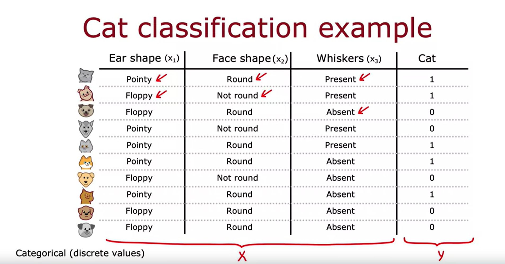
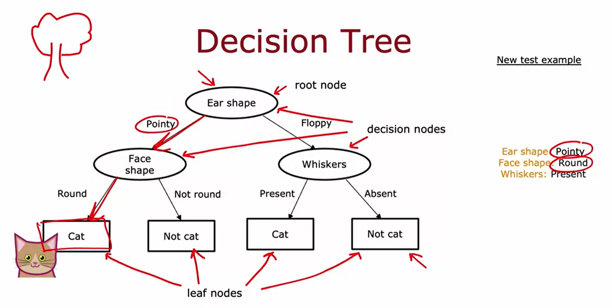
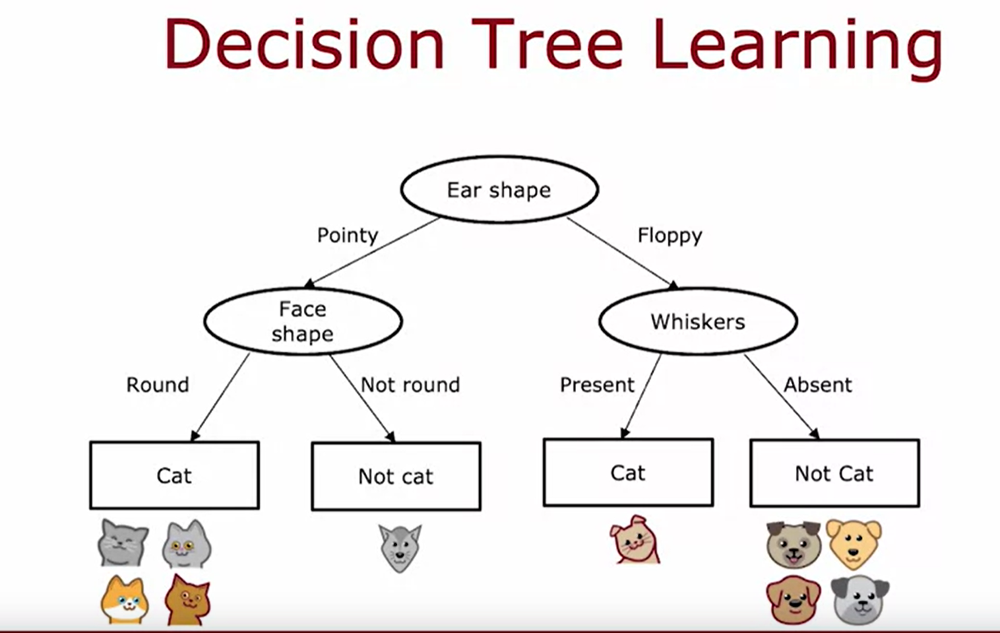
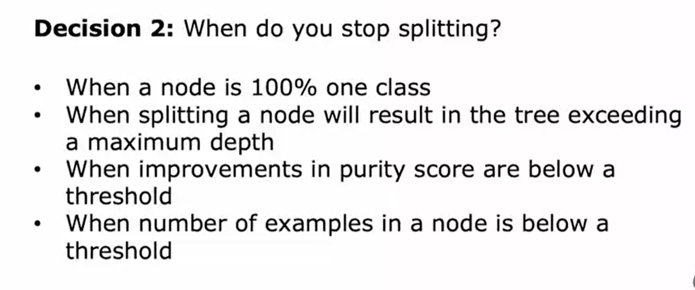
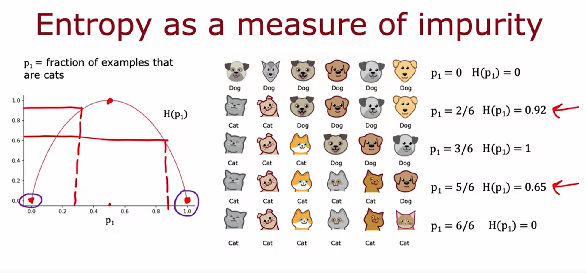
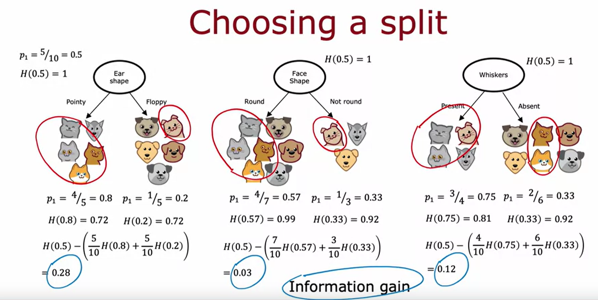
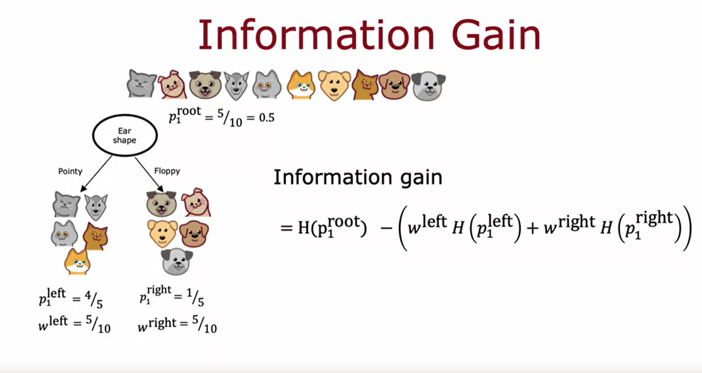
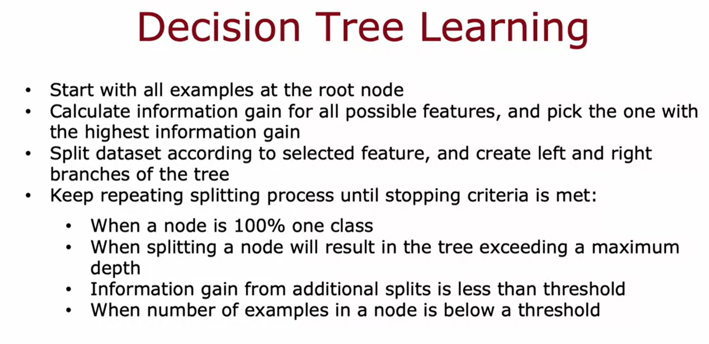
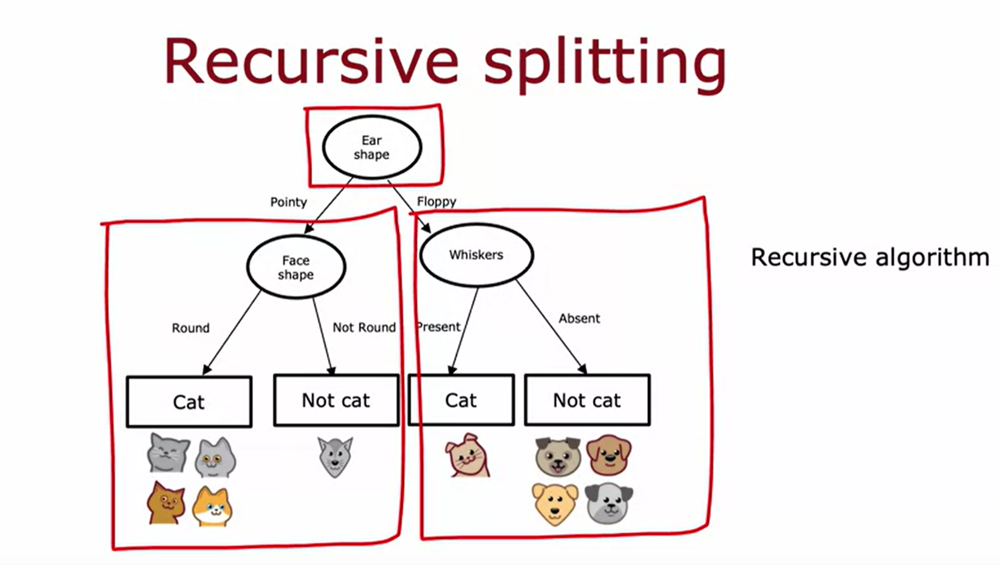
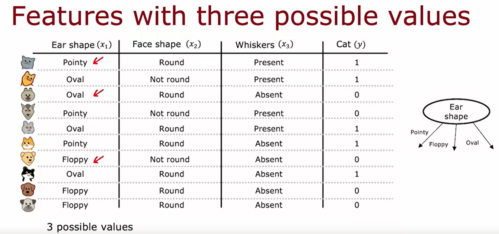

## (week 4) Decision Trees
- Decision Trees
    - Decision tree model
        - 
        - 
    - Learning process
        - 
        - Decision 1: How to choose what feature to split on each node
            - Maximize purity (entropy)
        - Decision 2: When do you stop spliiting
            - 
- Decision Tree Learning
    - Measuring purity
        - Entropy: measure of purity of data
        - 
        - 
    - Choosing a split: information gain
        - 
        - 
    - Putting it together
        - 
        - 
    - Using one hot encoding of categorical features
        - 
    - Continous valued features
        - 
- Tree Ensembles
    - Multiple decision trees