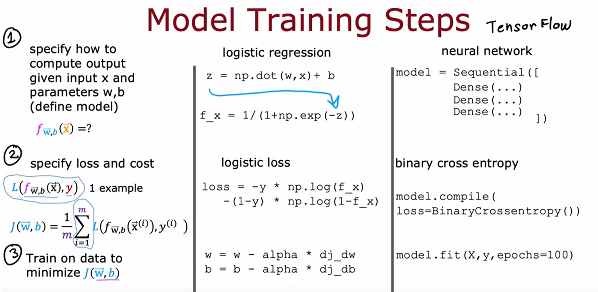
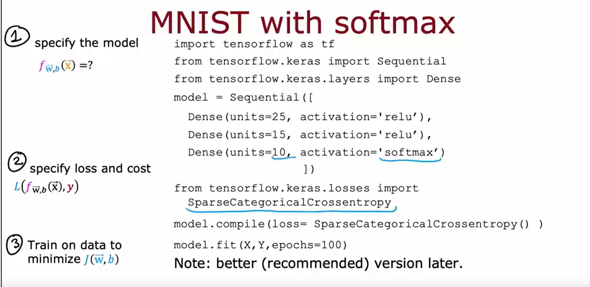
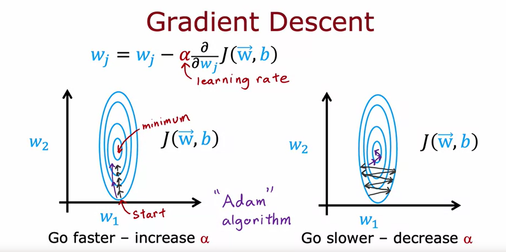
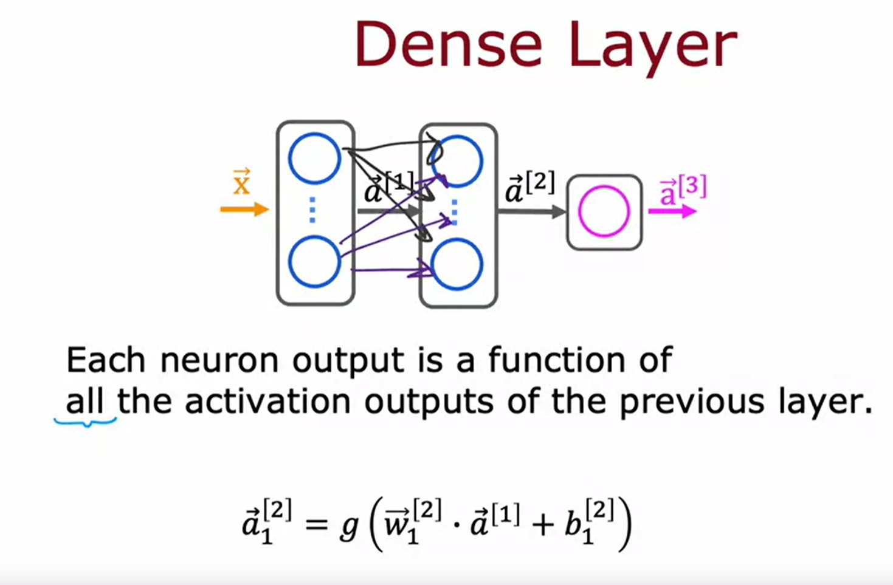

## (week 2) Neural Network Training
- Neural Network Training
    - TensorFlow Implementation
        - Step 1: how to compute forward inference.
        - Step 2: Compiles model using specific loss function.
        - Step 3: Train the model.
        - 
    - Training Details
        - Model Training Steps for logistic regression and Neural Network.
            - 
        - Step 1: Create the model
            - 
        - Step 2: Loss and Cost functions
            - 
        - Step 3: Gradient Descent
            - 
- Activation Functions
    - Alternatives to sigmoid function:
        - Rectified Linear Unit (RELU)
            - 
        - 
    - Choosing Activation functions:
        - Output Layer:
            - Binary classification problem, use sigmoid
            - Regression, use linear activation function
            - 
        - Hidden Layer:
            - Use relu most frequently.
            - 
        - Summary:
            - 
- Multiclass Classification
    - MultiClass
        - Classification, where y can take on a small number of discrete values
            - example: 1 - 10.
        - 
    - Softmax
        - Can take on multiple outputs, in this example 4 is just for fun
            - 
            - 
    - Softmax implementation
        - 
        - This code works, but theres a better version
            - 
    - Improved Softmax implementation
        - Improved logistic regression
            - 
            - 
        - Improved softmax
            - 
            - 
- Additional Neural Network Concepts
    - Advanced optimization
        - Adam optimization is faster than gradient descent.
            - 
            - 
            - 
    - Additional layer types
        - Dense Layer
            - 
        - Convolutional Layer
            - 
        - Convolutional Neural Network
            - 
*practice lab Neural Network Training - see coursera code*