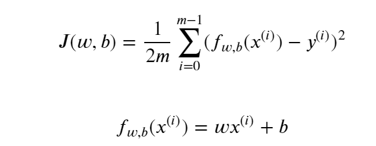
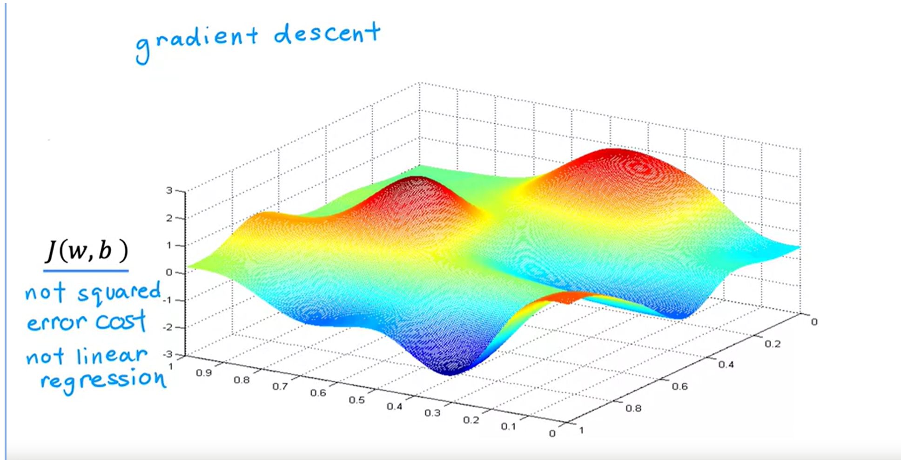

# Supervised vs. Unsupervised Machine Learning

**See Python files to understand machine learning code**

## Week 1

### What is machine Learning?

- Machine Learning -
    - "Field of study that gives computers the ability to learn without being explicitly programmed" - Arthur Samuel (1959)

### Machine Learning Algorithms

- Supervised Learning - Used most in real world applications, most rapid advancements.

**In this course we will learn practical advice for applying learning algorithms**

### Supervised Learning

**Maps x --> y**
**Learns from being given right answers**

**Two types:**
- Regression
    - Predict numbers from infinitely many possible outputs.
- Classification
    - Predict categories from small number of possible outputs.

#### Regression

- Algorithms that learn x (input) --> y (output) mappings. Learns from being given the right answers.

#### examples

1. 
- x = email,
- y = spam? (0/1),
- Application = spam filtering

2. 
- x = audio,
- y = text transcripts,
- Application = speech recognition

3. 
- x = English,
- y = spanish,
- Application = Machine Translation

**Most lucrative application is online advertising**

4. 
- x = ad, user info,
- y = click? (0/1),
- Application = Online advertising

5. 
- x = Image, radar info,
- y = position of other cars,
- Application = Self-driving car

6. 
- x = image of phone,
- y = defect? (0/1),
- Application = Visual inspection

**Regression: Housing prices prediction**

- Regression - Predict a number from infinitely many possible outputs
- x = house size in feet^2,
- y = price in $1000's,
- Application = housing price prediction

#### Classification

**Classification alogorthms predict categories**
- Predicts a small finite limited number of possible outputs

#### Examples

1. 
- Breast Cancer Detection - detects whether a tumor is malignant or benign.
- x1 = size,
- y = diagnosis, Benign(0) or malignant(1),
- malignant is deadly,
- begnign is not

- Two outputs means this is classification.
- Can also output multiple outputs, malignant 1, malignant 2, etc...

**Multiple inputs**

- x1 = age,
- x2 = tumor size,
- y = malignant(1) or benign(0),

- Algoritm finds a boundary that seperates malignant from benign.

### Unsupervised Learning

**Data that isnt associated without output labels**

*Find some structure, pattern, or something interesting within data*

*Data comes with x and no outpuy y*

**Types of unsupervised learning**
1. Clustering - groups similar data points together.
2. Anamoly Detection - used to detect unusual events.
3. Dimensionality Reduction - Compress data using fewer numbers.

#### Examples

1. 
- Clustering DNA Microarray - idea is to measure how much a certain gene is active in an individual and the algorithm groups similar individuals
- You dont tell the algorithm specific details, automatically find structure and types of individuals.

### Linear Regresssion
**See Modelrepresentation.py for code**
*Fitting a straight line to your data*

- Most concepts you see here, apply to more advanced problems.
- Regression models predicts numbers.

#### Terminology

- Training Set: 
    - Dataset used to train the model
- x = 'Input' or 'Feature'
- y = 'Output' or 'Target variable'
- m = Total number of training examples
- (x,y) = single training example
- (x(i), y(i)) = I(th) training example
- f = model
- y^ = prediction, estimated y
- a = scalar, non bold
- *a* = vector, bold
- w = parameter: weight
- b = parameter: bias

**How to represent f**

- Slope formula
- f_w,b = wx+b
    - also known as f(x)

### Cost Function

**See Costfunction.py for code implementation of cost function for linear regression**

- (w,b) = parameters, coefficiencents, weights
    - Parameters = Variables in training you adjust in order to improve the model
- Choose values for (w,b) that fits our data best so our prediction(y^) is close to our target(y)
    - to find the values for (w,b) we use a cost function
- Cost Function
    - (y^(i) - y(i)) = error, how far our prediction is from our target.
    - The formula below is the formula we use to calculate the cost function for the data set
    - 

**The whole purpose is to adjust the values of w (weight) and b (bias) to get a smaller j value (cost function).**

*See OneNote Link In ReadMe for Practice Problems*
- I recommend at least looking at/working through a few problems.

### Gradient Descent

**Used to train some of the most advanced neural network models today (deep learning models)**

- Algorithm you can use to minimize any function.

#### Linear Regression

- Steps
    - Start with some (w, b) # Set w = 0, b = 0 initially
    - Keep changing (w, b) to reduce j(w, b) until we settle at or near a minimum

*Type of cost function you may get when training a neural network model*
