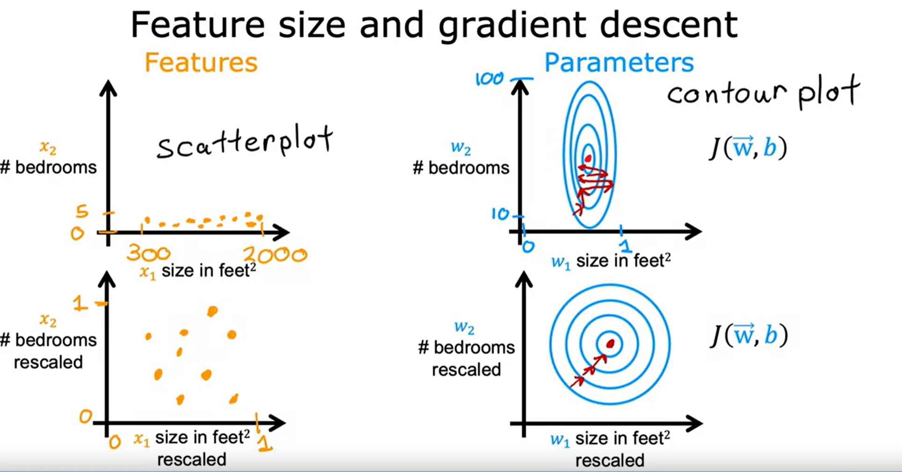

# Regression with multiple input variables
- **See Python files to understand machine learning code**
- **Topics covered in this file**
- Multiple Linear Regression.
- Gradient Descent in practice.

## Week 1

## Multiple Linear Regression
*See Vectorization.py for code*
- Linear Regression with multiple features
#### Multiple features
- x_j = jth feature.
- n = number of features.
- x(i) = features of ith training example.
- x_j(i) = value of feature j in ith training example.
- 
- 
- 
- w and b are both parameters, 'w' is a vector & 'b' is a number.
- Use the dot product between vector 'w' and vector 'x'.

#### Vectorization Part 1
*Makes code shorter and more efficiently*
- Parameters and feautres
    - Numerical Linear Algebra Library: *NumPy*
    - 
    - Best practice code:
        - **f = np.dot(w,x) + b**
        - one line of code, and is much faster
    - 
#### Vectorization Part 2
*How Vectorization works*
- 
- Computer gets all values of vectors w and x, and in a single step multiplies each pair in parallel.
- Takes the numbers to add them all together efficiently.
- Can perform code with vectorization much faster, very beneficial to large models.

**Example**
- Vectors W and d.
- W = W - (0.1) * d
- 

#### Gradient desent for multiple linear regression
*See GradientVec.py for code*
- Review so far.
- 
- Gradient descent with multiple features.
- 
- Alternative to gradient descent, works only with linear regression.
    - Solve for w and b without iterations
    - 

## Gradient Descent in practice
**
#### Feature Scaling
- *Enables Gradient descent to run much faster*
- 
- Notice that X1 has a large value range and X2 has a small value range.
- The model picks a small value for W1 and a larger value for W2.
- 
- We scale features so gradient descent doesnt bounce back and forth all the time.
- Notice X1 and X2 now both range from 0 to 1.
- Makes the countour plot look more like circles.
- 
- **Implement feature scaling**
- To scale a feature (3 ways):
    - Divide by the maximum
        - 
    - Mean Normalization.
        - Find the average of X1, then perform (X1 - average) / (Max - Min)
        - 
    - Z-Score normalization
        - Calculate Mean and standard deviation
        - Then perform (X1 - average) / (standard deviation)
        - 
- Aim to have to scale from range -1 to 1
- 
#### Checking gradient descent is working correctly
- Plot the cost function against every iteration.
- If J(w, b) decreases after every iteration then it is working properly.
- 
- Once curve no longer decreses, then it has converged.
#### Choosing the learning rate
- If gradient descent isnt working, set the α (Learning rate) to a very low number and that should work.
    - If this doesn't work, then there is most likely a bug in the code.
    - Be carefult not to make it too small, as if its too small gd takes a long time to converge.
    - A good practice is to start small and increase the size by 3x.
    - 
- 
#### Feature Engineering
- Example:
    - X1 = Frontage
    - X2 = Depth
    - f(x) = W1X1 +W2X2 + b
    **Area is a better feature**
    - Create new feature X3 = X1*X2
    - 
#### Polynomial Regression
**Feature engineering that lets you fit curves**
- Implementing this technique, a key note is feature scaling becomes increasingly important.
- 
- To leaarn what features to use, refer to the second course.