# Classification

**Topics covered in this file**
- Use logistic regression for binary classification
- Implement logistic regression for binary classification
- Address overfitting using regularization, to improve model performance
**See Python files to understand machine learning code**

## Week 3

### Classification with logistic regression

#### Motivations

- 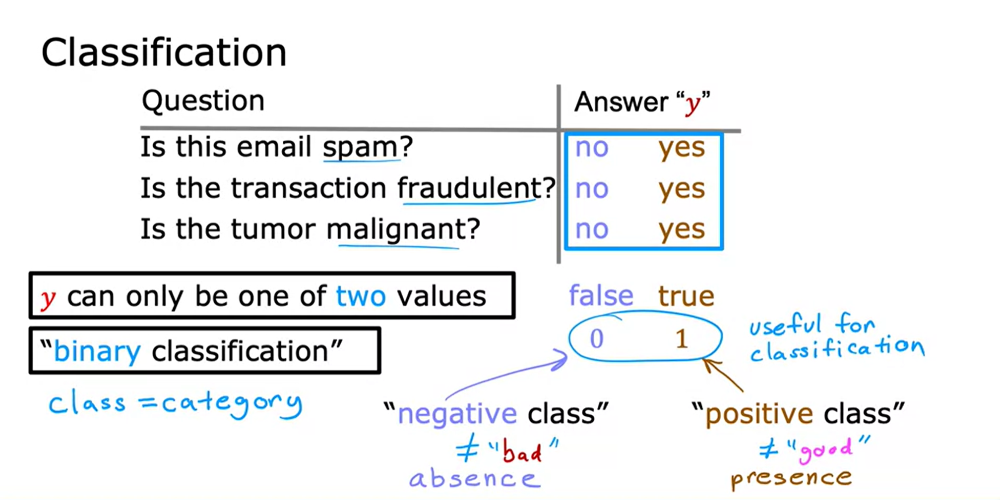
- 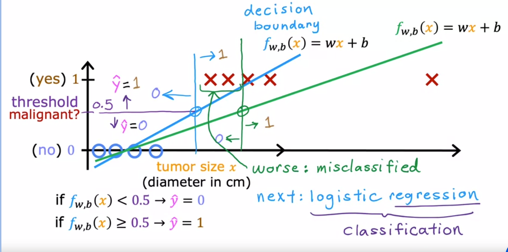
- Notes:
    - Binary Classification
        - false = 0
        - True = 1

#### Logistic Regression
- Most used classification algorithm
- Classifying whether a tumor is maligant (1) or benign (0)
- 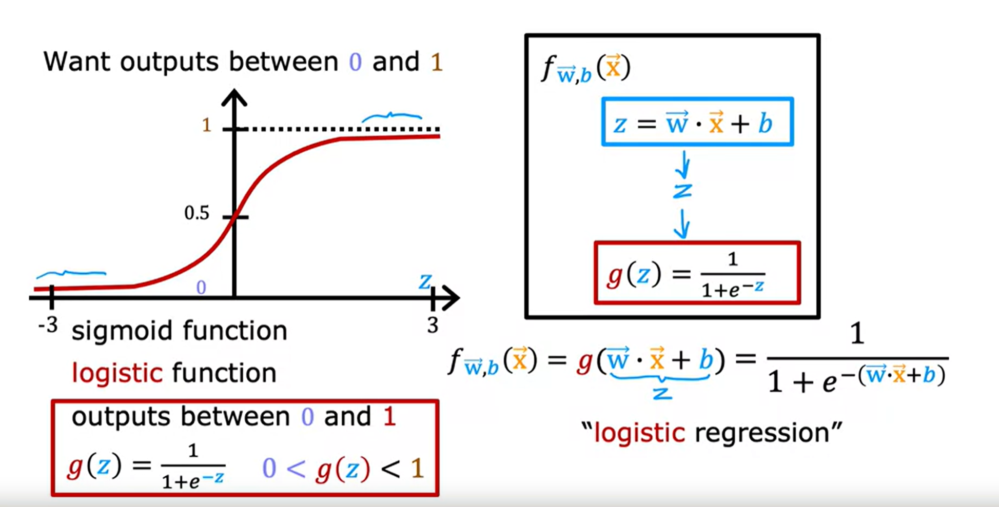
- In the logistic regression model, it takes two equations z and uses it in equation g.
- "probability" that class is 1.
#### Decision Boundaries
- 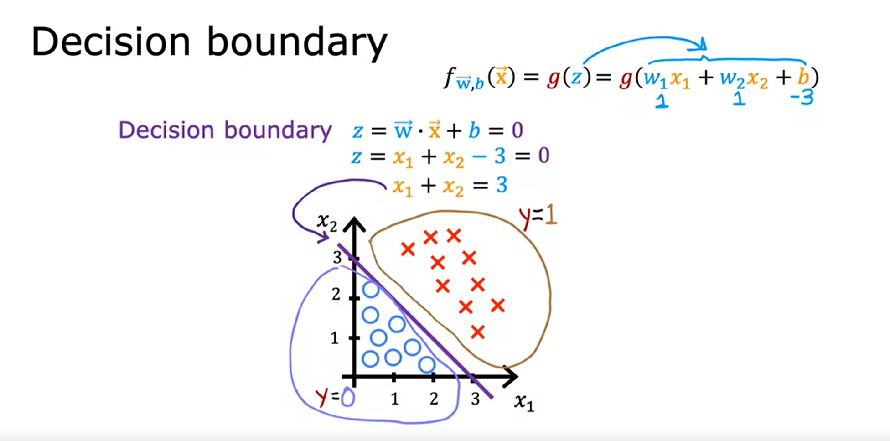
-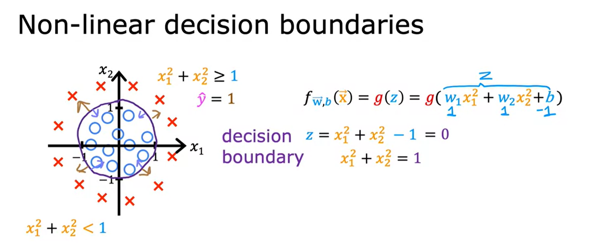
### Cost function for logistic regression
- 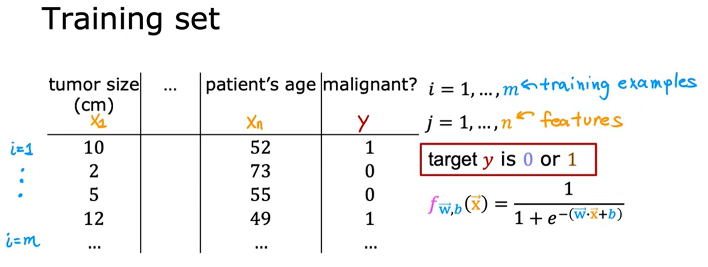
- Squared error is not a good choice for logistic regression
- 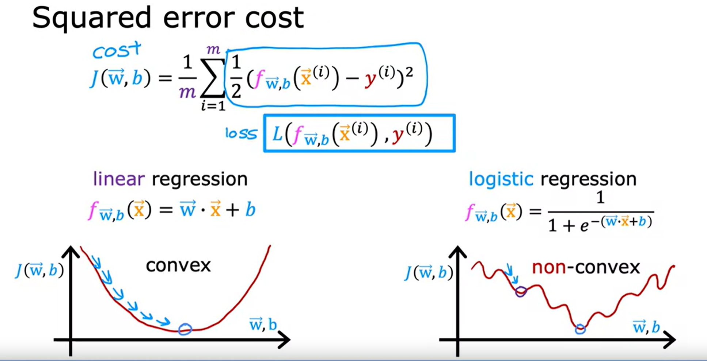
- When y = 1
    - 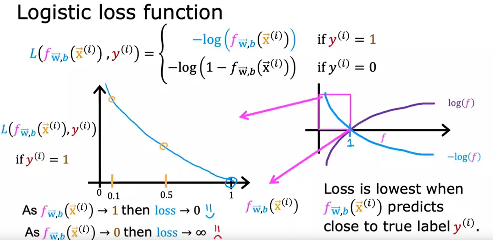
- When y = 0
    - 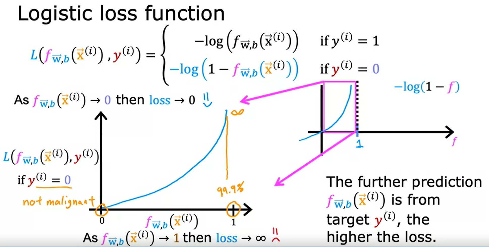
- **New Definition for loss function for logistic regression.**
- 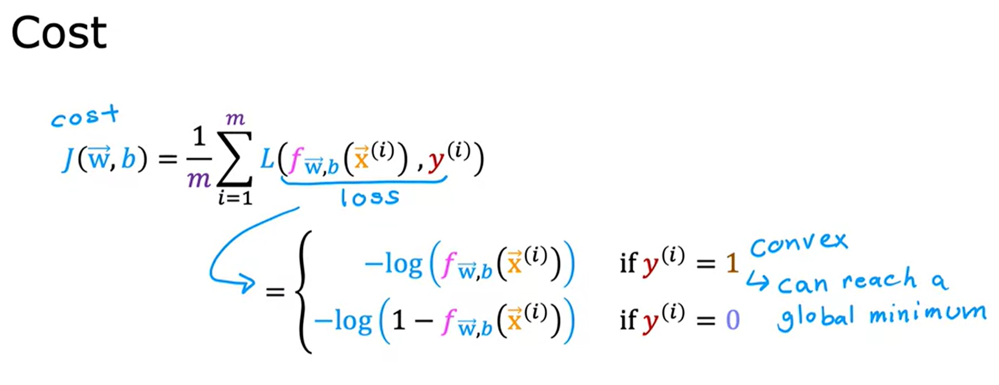
#### Simplified Loss/Cost function
- Use this function for gradient descent
- 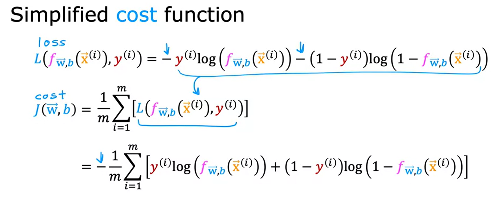
#### Gradient Descent implementation
- 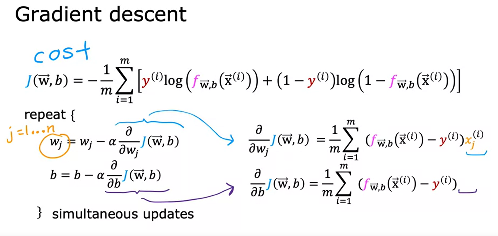
- 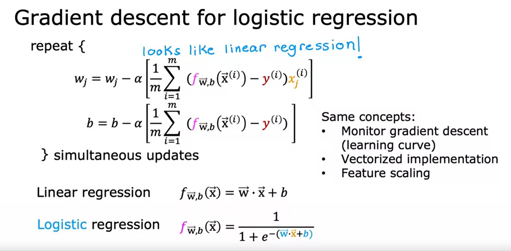
### Overfitting